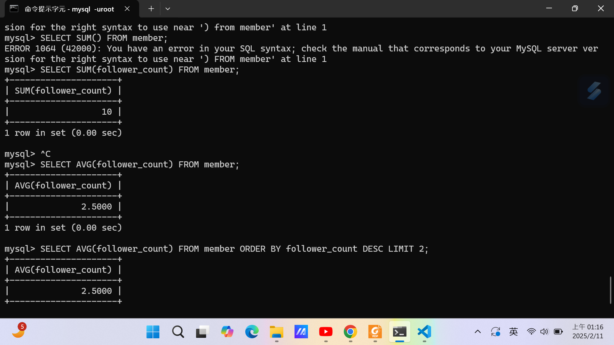

### Task2
```
USE website; 
CREATE TABLE member;
CREATE TABLE member(
    id BIGINT PRIMARY KEY AUTO_INCREMENT,
    name VARCHAR(255) NOT NULL,
    username VARCHAR(255) NOT NULL,
    password VARCHAR(255) NOT NULL,
    follower_count INT UNSIGNED NOT NULL DEFAULT 0,
    time DATETIME NOT NULL DEFAULT CURRENT_TIMESTAMP);
```


### TASK3
```
INSERT INTO member(name, username, password, follower_count)VALUES('test','test','test',4);

INSERT INTO member(name, username, password, follower_count)VALUES('one','one','one',1);

INSERT INTO member(name, username, password, follower_count)VALUES('two','two','two',2);

INSERT INTO member(name, username, password, follower_count)VALUES('three','three','three',3);
```


```
SELECT* FROM member;

SELECT * FROM member ORDER BY time DESC;

SELECT * FROM member ORDER BY time DESC LIMIT 1,3;
```


```
SELECT * FROM member WHERE username = 'test';
SELECT * FROM member WHERE name LIKE '%es%';
SELECT * FROM member WHERE username = 'test' and password = 'test';
UPDATE member SET name = 'test2' WHERE username = 'test';
```


### Task4
```
SELECT COUNT(*) FROM member;

SELECT SUM(follower_count) FROM member;

SELECT AVG(follower_count) FROM member;

SELECT AVG(follower_count) FROM member ORDER BY follower_count DESC LIMIT 2;
```



### TASK5
```
CREATE TABLE message(
    id BIGINT PRIMARY KEY AUTO_INCREMENT,
    member_id BIGINT NOT NULL,
    FOREIGN KEY(member_id) REFERENCES member(id),
    content VARCHAR(255) NOT NULL,
    like_count INT UNSIGNED NOT NULL DEFAULT 0,
    time DATETIME DEFAULT CURRENT_TIMESTAMP);

INSERT INTO message(member_id, content, like_count) VALUES(1,'hello', 5);
INSERT INTO message(member_id, content, like_count) VALUES(2,'hello2', 6);
INSERT INTO message(member_id, content, like_count) VALUES(3,'hello3', 7);
INSERT INTO message(member_id, content, like_count) VALUES(4,'hello4', 8);

SELECT message.id, member.name, message.member_id, message.content, message.like_count, message.time FROM message INNER JOIN member ON member.id = message.member_id;

SELECT message.id, member.name, message.member_id, message.content, message.like_count, message.time FROM message INNER JOIN member ON member.id = message.member_id WHERE username = 'test';

SELECT AVG(like_count) FROM message INNER JOIN member ON member.id = message.member_id WHERE username = 'test';

SELECT member.username, AVG(like_count) FROM message INNER JOIN member ON member.id = message.member_id GROUP BY member.username;
```


